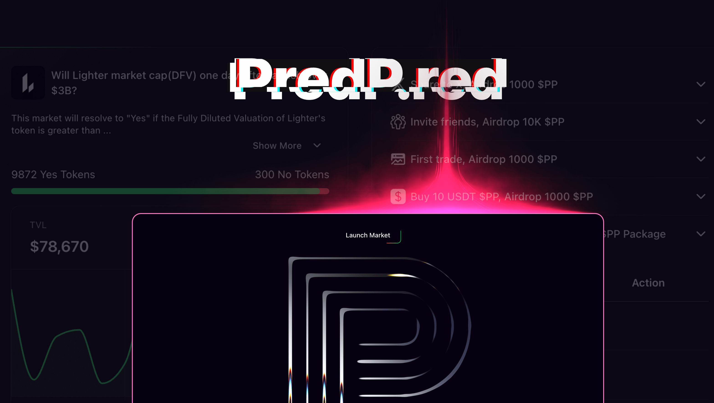
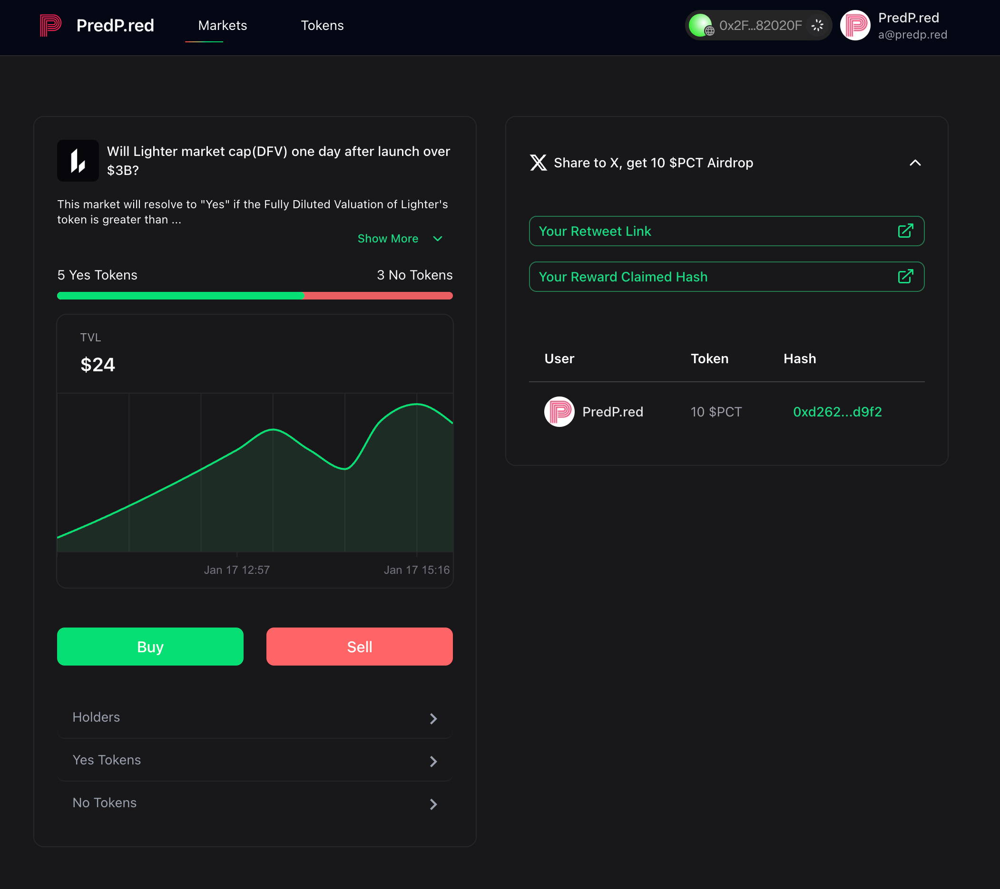
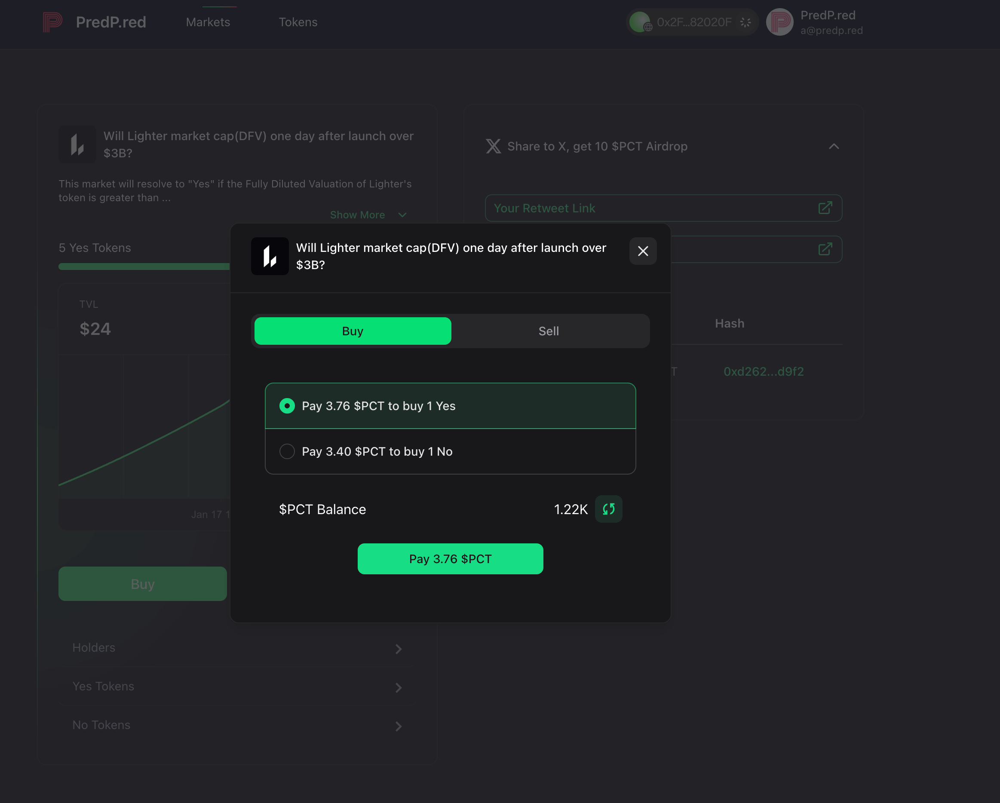
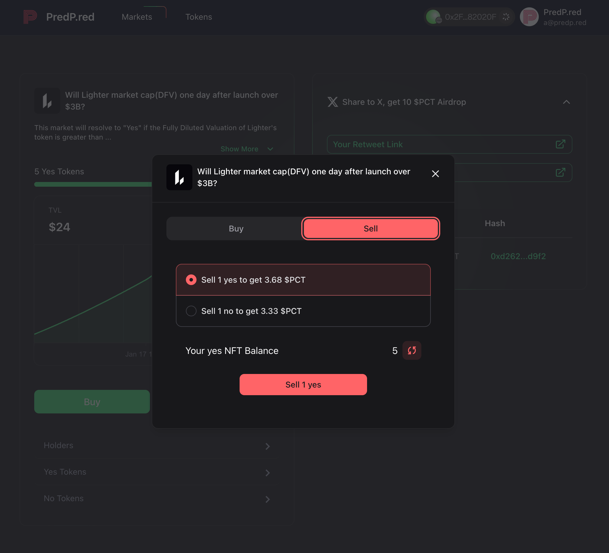
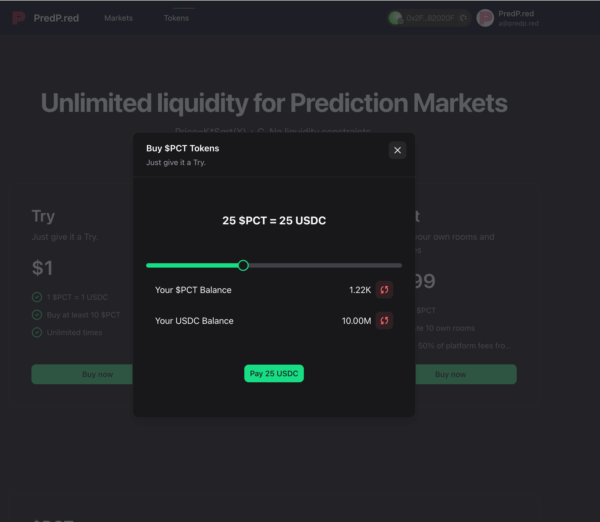
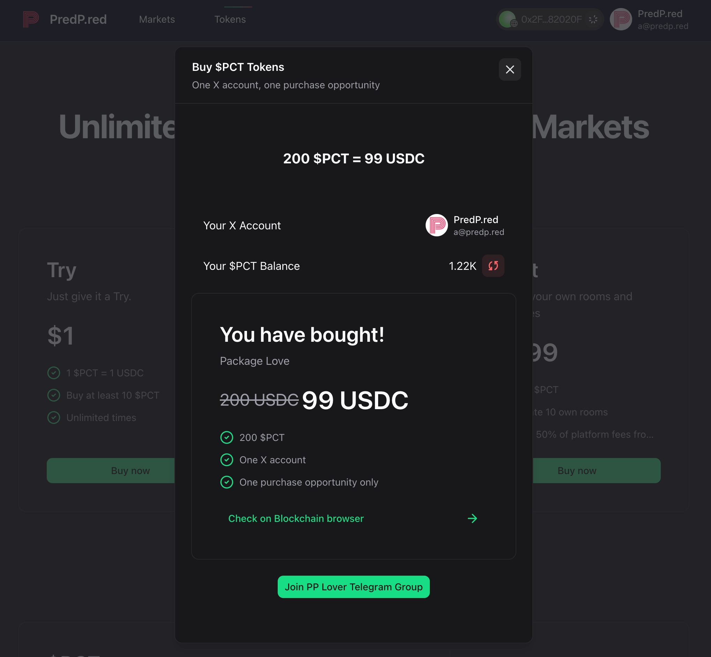
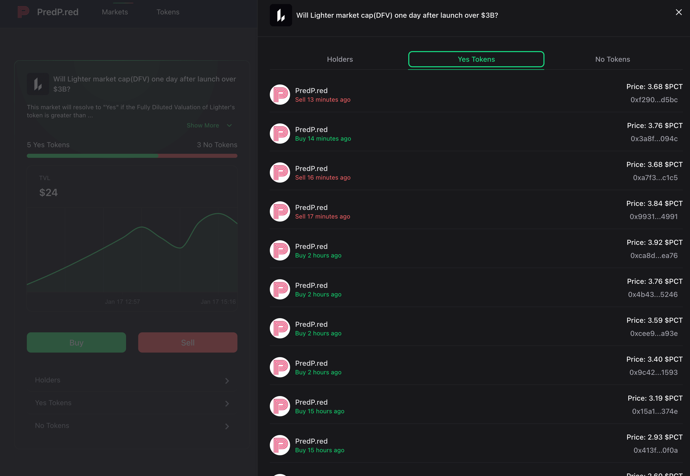

# PredP.red Docs



*PredP.red application landing page showcasing the prediction market platform*.

* DApp: https://PredP.red
* X: https://x.com/PredPred_HQ
* bonding curve: https://www.desmos.com/calculator/feajupdyju
* [pitch deck](https://www.canva.com/design/DAG_Cq1z93E/ir5ze-JHcyavi0r1lg-K8Q/edit?utm_content=DAG_Cq1z93E&utm_campaign=designshare&utm_medium=link2&utm_source=sharebutton)

## 1. Project Overview

PredP.red is a fully decentralized prediction market application based on blockchain technology that allows users to predict various event outcomes and earn rewards. Built on the EIP-2535 Diamond Standard, the application features high scalability and flexibility, aiming to provide users with secure, transparent, and efficient prediction market services.

### 1.1 Project Background

As an information aggregation tool, prediction markets can effectively collect and integrate information dispersed among different participants to form collective predictions about future events. Traditional prediction markets suffer from issues such as centralized control, low transparency, and high trust costs, while blockchain-based decentralized prediction markets can address these problems, providing users with a more fair and transparent prediction environment.

PredP.red was developed against this backdrop, aiming to leverage the advantages of blockchain technology to build an efficient, secure, and transparent decentralized prediction market platform.

### 1.3 Problem & Solution

## Core Problems in Traditional Prediction Markets

### Limited Liquidity & Price Volatility
Traditional prediction markets suffer from insufficient liquidity, leaving users trapped during volatility. Prices fluctuate wildly, making trading unpredictable, while complex mechanisms deter casual users.

### Market Manipulation
Centralized platforms are vulnerable: insiders altering rules, bad actors exploiting short-term markets, and users losing trust after falling victim to rigged outcomes.

### Centralized Control & Opacity
Traditional platforms operate with centralized authority, lacking transparency in operations and fund management, requiring high trust costs, and imposing geographic restrictions.

### Inaccessible to Casual Users
The "all-or-nothing" nature deters risk-averse users, creates uneven playing fields dominated by experts, and misses valuable collective wisdom from diverse backgrounds.

### Stifled Innovation
Centralized control limits market creation to platform-approved topics, restricting creativity and offering no incentives for users to create quality markets.

## How PredP.red Solves These Problems

### Infinite Liquidity Through Non-Linear Price Model
Our core formula `Price = K * Sqrt(X) + C` creates unlimited liquidity, smooth price curves, accessible entry, and fair market signals.

### Anti-Manipulation Design
We build markets resistant to manipulation by focusing on long-term, multi-factor topics that no single entity can control, leveraging blockchain immutability.

### Decentralized & Transparent Architecture
Based on the EIP-2535 Diamond Standard, our modular, upgradable smart contracts ensure on-chain transparency, global accessibility, and reduced trust costs.

### Inclusive Incentive Mechanism
Our hybrid reward system includes winning rewards, loss compensation (PFT tokens), 50% fee-sharing for market creators, and an inclusive learning ecosystem.

### User-Driven Market Creation
We empower users to create markets on any topic, earn direct financial rewards, build communities around shared interests, and drive platform growth through decentralized innovation.

### 1.2 Our Motivation

Every decision in building PredP.red stems from our commitment to solving these real problems in prediction markets. Here's what drives us:

#### Liquidity Crisis Solution

We witnessed users trapped in positions during volatility due to insufficient liquidity, markets manipulated by large traders, and complex mechanisms deterring casual participation. This frustration led us to develop our core price model: `Price = K * Sqrt(X) + C`. This formula wasn't just technical—it was our answer to create "infinite liquidity," where anyone could trade anytime regardless of market size, with prices smoothly reflecting true sentiment.

#### Fighting Market Manipulation

Market manipulation outraged us: platforms altering rules when outcomes didn't favor insiders, bad actors exploiting short-term markets, and users abandoning prediction markets entirely after falling victim to rigged outcomes. We designed markets inherently resistant to manipulation, focusing on long-term, multi-factor topics like "February's monthly BTC closing price average range"—too complex and time-consuming for any single entity to control.

#### Community-Led Growth

We believed the best ideas come from diverse communities, not just centralized teams. Traditional platforms restricted who could create markets, limiting topics to narrow interests, and offered no incentives for creators to promote quality markets. Our 50% fee-sharing model turns users into stakeholders, giving them direct financial incentive to create engaging markets and share them with their networks.

#### Democratizing Access

We asked: How do we make prediction markets accessible to everyone, not just risk-tolerant experts? The "all-or-nothing" nature deterred casual users, experienced traders dominated markets, and excluding risk-averse users meant losing valuable perspectives. Our solution: the $PFT token compensating incorrect predictions. This wasn't just a consolation prize—it transformed prediction markets from high-stakes gambling into an inclusive learning ecosystem.

#### Our Unifying Vision

PredP.red is our response to a broken status quo. We're driven by the belief that technology can create fairer systems where collective wisdom is valued, rules are transparent, and everyone has a stake in success. Every challenge we overcome, every feature we launch, and every user we onboard reaffirms that our motivations are the building blocks of a prediction market that truly works for everyone.




*PredP.red application main interface showcasing the prediction market platform*.

## 2. Technical Principles

### 2.1 Architecture Design

PredP.red adopts a modular architecture design based on the EIP-2535 Diamond Standard (Diamond Pattern). This architecture allows adding new features without affecting existing functionalities, enabling contract upgradability.

**Core Components:**

- **App.sol**: Application entry contract, inherits from the Diamond contract, responsible for receiving and forwarding external calls
- **AppStorage.sol**: Storage contract, defines the state data structures for the platform and markets
- **Admin Module**: Responsible for platform management functions, such as updating platform metadata, withdrawing fees, etc.
- **Market Module**: Responsible for core market functions, such as market creation, trading, settlement, etc.

### 2.2 Data Structures

PredP.red defines the following core data structures:

```solidity
// Platform metadata
struct PlatformMeta {
    address pctAddress;        // Pred Credit Token address
    uint256 pctDecimals;       // PCT token decimals
    address pftAddress;        // Pred Failed Token address
}

// Market data structure
struct Market {
    bytes32 digest;            // Unique market identifier
    uint256 resultNftId;       // Result NFT ID
    address rewardERC20Token;  // Reward token address
    uint256 rewardTotalAmount; // Total reward amount
    uint256 yesNftId;          // "Yes" NFT ID
    uint256 noNftId;           // "No" NFT ID
    bool isEnabled;            // Whether the market is enabled
    bool isEnded;              // Whether the market has ended
    bool isFinalized;          // Whether the market has been finalized
    uint256 yesSupply;         // "Yes" NFT supply
    uint256 noSupply;          // "No" NFT supply
    uint256 k;                 // Price curve parameter k
    uint256 c;                 // Price curve parameter c
    uint256 poolTotalAmount;   // Total pool amount
    uint256 platformFeeBps;    // Platform fee ratio (per ten thousand)
    uint256 platformFeeAmount; // Platform fee amount collected
    uint256 rewardTotalPayout; // Total reward payout amount
    uint256 pcPayout;          // PCT payout amount
    uint256 ptTokenPayout;     // Failed token payout amount
}
```



*Market creation and trading interface showing the prediction NFT purchase process*.

### 2.3 Core Function Implementation

#### 2.3.1 Market Creation and Management

- **Create Market**: Users with appropriate permissions can create new prediction markets, setting market parameters such as reward tokens, reward amounts, price curve parameters, etc.
- **Update Market**: Can update some market parameters, such as result NFT ID, total reward amount, market status, etc.
- **Enable/Disable Market**: Administrators can control the enabled status of markets
- **End Market**: Market operators can end markets and set results
- **Finalize Market**: Administrators can finalize market results, allowing users to claim rewards

#### 2.3.2 Trading Mechanism

- **Purchase Prediction NFTs**: Users can use PCT tokens to purchase "Yes" or "No" prediction NFTs
- **Sell Prediction NFTs**: Users can sell their held prediction NFTs to obtain PCT tokens
- **Price Calculation**: Uses a non-linear price model where prices change with supply

#### 2.3.3 Reward Mechanism

- **Winning Rewards**: Users who predict correctly can claim reward tokens and PCT tokens from the pool
- **Loss Compensation**: Users who predict incorrectly can receive Failed Tokens (PFT) as compensation

### 2.4 Price Model

PredP.red adopts a non-linear price model where prices rise with increasing supply, following the formula:

```solidity
price = k * sqrt(x) + c
```

Where:
- `x` is the current supply of prediction NFTs
- `k` and `c` are market parameters set by the market creator
- `sqrt(x)` is the square root of x

This price model has the following advantages:
- Prices gradually rise with increasing prediction NFT supply, reflecting market scarcity
- Early participants can purchase at lower prices, encouraging early participation
- The price curve is smooth, avoiding sharp fluctuations

### 2.5 Security Mechanisms

- **Access Control**: Implements Role-Based Access Control (RBAC), where different functions require different permissions
- **Reentrancy Protection**: Implements reentrancy protection mechanisms to prevent reentrancy attacks
- **Parameter Validation**: Strictly validates all input parameters to ensure data validity
- **Event Logging**: All important operations are recorded in event logs for easy auditing and tracking




*Business model diagram depicting PredP.red's value proposition and target user segments*.

## 3. Business Model

### 3.1 Value Proposition

PredP.red provides users with a decentralized prediction market platform with the following value propositions:

- **Transparency**: All market data and transaction records are stored on the blockchain, publicly transparent and immutable
- **Decentralization**: No centralized authority control, users can freely participate and exit
- **Security**: Based on blockchain technology and smart contracts, ensuring transaction security and reliability
- **Flexibility**: Supports various types of prediction markets, including sports events, political elections, financial markets, etc.
- **Incentive Mechanism**: Provides clear reward and compensation mechanisms to encourage user participation in predictions

### 3.2 Target Users

- **Individual Investors**: Individual users who want to earn profits through prediction markets
- **Institutional Investors**: Financial institutions and research organizations that need to collect market information
- **Content Creators**: Users who want to create prediction markets on specific topics
- **Community Organizations**: Organizations that want to conduct community governance and decision-making through prediction markets

### 3.3 Partners

- **Blockchain Platforms**: Collaborate with various blockchain platforms to expand application coverage
- **Data Providers**: Partner with data providers to ensure accuracy and timeliness of prediction event results
- **Wallet Providers**: Collaborate with wallet providers to improve user convenience
- **Exchanges**: Partner with exchanges to enable trading of PCT, PFT, and other tokens



*Revenue model visualization showing fee structures and token economy components*.

## 4. Revenue Model

### 4.1 Platform Transaction Fees

PredP.red generates revenue by charging transaction fees, specifically including:

- **Purchase Fees**: The platform charges a certain percentage of transaction fees when users purchase prediction NFTs
- **Selling Fees**: The platform charges a certain percentage of transaction fees when users sell prediction NFTs
- **Fee Ratio**: The fee ratio is set by the market creator, typically 0.1%-5% of the transaction amount

### 4.2 Market Creation Fees

- **Market Creation Fee**: Users need to pay a certain creation fee when creating new markets
- **Fee Usage**: Used to cover blockchain network fees and platform operation costs

### 4.3 Token Economy

- **PCT Token**: As the platform's transaction medium, users need to use PCT tokens to purchase prediction NFTs
- **PFT Token**: As loss compensation, users can use PFT tokens within the platform ecosystem
- **Token Appreciation**: With the increase in platform users and transaction volume, the value of PCT and PFT tokens may rise

### 4.4 Premium Feature Charges

- **Premium Market Features**: Provide premium market features such as custom market parameters, priority settlement, etc., with additional charges
- **Data Analysis Services**: Provide prediction market data analysis services for institutional users with subscription fees
- **API Services**: Provide API services to allow third-party applications to integrate PredP.red functions, with API call fees



*Technical innovation diagram highlighting the diamond pattern architecture and price model*.

## 5. Technical Innovations

### 5.1 Diamond Pattern Architecture

Adopts the EIP-2535 Diamond Standard to achieve smart contract upgradability, allowing adding new features without affecting existing functionalities.

### 5.2 Non-Linear Price Model

Uses a non-linear price model where prices change with supply, reflecting market scarcity and participants' risk preferences.

### 5.3 Hybrid Incentive Mechanism

Simultaneously provides winning rewards and loss compensation, balancing risks and returns, encouraging more users to participate in prediction markets.

### 5.4 Decentralized Governance

Adopts a decentralized governance model where platform parameters and decisions are jointly determined by the community, improving the platform's democracy and transparency.

## 6. Market Competition Analysis

### 6.1 Existing Competitors

- **Polymarket**: Centralized prediction market platform supporting multiple blockchains
- **Kalshi**: Centralized prediction market platform supporting multiple blockchains

### 6.2 Competitive Advantages

- **Technical Architecture**: Adopts Diamond Pattern with better scalability and flexibility
- **Price Model**: Non-linear price model better reflects market supply and demand relationships
- **User Experience**: Optimized user interface and trading process to improve user experience
- **Token Economy**: Complete token economic system to incentivize user participation



*Market competition analysis comparing PredP.red with existing prediction market platforms*.

## 7. Development Plan

### 7.1 Short-Term Plan (0-6 Months)

- Complete testing and auditing of PredP.red
- Launch on mainnet, supporting basic prediction market functions
- Establish community and attract early users
- Collaborate with data providers to offer more prediction events

### 7.2 Mid-Term Plan (6-12 Months)

- Add more advanced features such as leveraged trading, liquidity mining, etc.
- Support more blockchain platforms
- Collaborate with exchanges to enable trading of PCT and PFT tokens
- Expand market and attract institutional users

### 7.3 Long-Term Plan (12+ Months)

- Implement fully decentralized governance
- Support cross-chain transactions and cross-chain prediction markets
- Build a prediction market ecosystem to attract more developers and users
- Become a leading global decentralized prediction market platform
